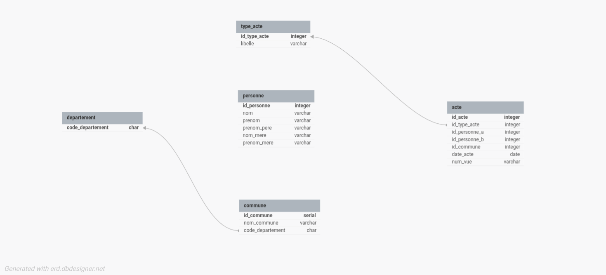

# Projet Modélisation de bases de données — Archives Vendée  
**160-6-12 — 2024-2025**

---

## (a) Prénoms et noms

**Mohamed Kaba**

---

## (b) Modèle relationnel (sortie DBDesigner)



*Schéma réalisé sur dbdesigner.net : tables departement, commune, type_acte, personne, acte (attributs et relations).*

---

## (c) Requêtes et résultats (données mariages_L3_5k)

### Requête 1 — Quantité de communes par département

```sql
SELECT d.code_departement, COUNT(c.id_commune) AS nb_communes
FROM departement d
LEFT JOIN commune c ON c.code_departement = d.code_departement
GROUP BY d.code_departement
ORDER BY d.code_departement;
```

**Résultat :**

| code_departement | nb_communes |
|------------------|-------------|
| 44               | 9           |
| 49               | 2           |
| 79               | 51          |
| 85               | 313         |

---

### Requête 2 — Quantité d’actes à LUÇON

```sql
SELECT COUNT(*) AS nb_actes_lucon
FROM acte a
JOIN commune c ON a.id_commune = c.id_commune
WHERE c.nom_commune = 'LUÇON';
```

**Résultat :** 105

---

### Requête 3 — Quantité de « contrats de mariage » avant 1855

```sql
SELECT COUNT(*) AS nb_contrats_avant_1855
FROM acte a
JOIN type_acte t ON a.id_type_acte = t.id_type_acte
WHERE t.libelle = 'Contrat de mariage'
  AND a.date_acte < '1855-01-01';
```

**Résultat :** 196

---

### Requête 4 — Commune avec le plus de « publications de mariage »

```sql
SELECT c.nom_commune, c.code_departement, COUNT(*) AS nb_publications
FROM acte a
JOIN type_acte t ON a.id_type_acte = t.id_type_acte
JOIN commune c ON a.id_commune = c.id_commune
WHERE t.libelle = 'Publication de mariage'
GROUP BY c.id_commune, c.nom_commune, c.code_departement
ORDER BY nb_publications DESC
LIMIT 1;
```

**Résultat :** SAINT PIERRE DU CHEMIN (85) — 20 publications

---

### Requête 5 — Date du premier et du dernier acte

```sql
SELECT MIN(a.date_acte) AS premier_acte, MAX(a.date_acte) AS dernier_acte
FROM acte a
WHERE a.date_acte IS NOT NULL;
```

**Résultat :** Premier acte : 1581-12-23 — Dernier acte : 1915-09-14

---

## BONUS — Données mariages_L3.csv (~564k enregistrements)

### (d) Difficultés rencontrées et solutions

- **Volume des données**  
  Le fichier `mariages_L3.csv` contient environ 564 000 lignes. L’extraction prend plus de temps et produit beaucoup plus de personnes et d’actes. *Solution :* même script Python (`extract_and_prepare_data.py`) en le lançant avec le chemin vers `mariages_L3.csv` ; le schéma de la base reste inchangé.

- **Données « bruitées » — types d’acte**  
  Dans le fichier complet, il apparaît plus de 7 types d’acte (p.ex. « Autorisation de mariage », « Transcription de mariage », « Rectification de naissance », etc.). *Solution :* le schéma garde une table `type_acte` avec un libellé libre ; tous les types présents dans le CSV sont insérés, sans casser les clés étrangères. Les requêtes qui ciblent un type précis (ex. « Contrat de mariage », « Publication de mariage ») restent valides.

- **Lignes incomplètes ou invalides**  
  Certaines lignes ont moins de 16 colonnes ou un code département non valide (hors 44, 49, 79, 85). *Solution :* le script ignore ces lignes (aucune insertion en base pour elles), ce qui évite les erreurs à l’import.

- **Valeurs manquantes (n/a, dates vides)**  
  Beaucoup de champs sont à « n/a » ou vides (date, num_vue). *Solution :* normalisation en `NULL` à l’export (écriture `\N` dans le CSV) et import en format TEXT pour que PostgreSQL interprète correctement les NULL.

- **Réutilisation du même schéma**  
  La modélisation et la base ne changent pas entre le jeu 5k et le jeu complet. *Solution :* on vide les tables (`TRUNCATE ... CASCADE`), on régénère les CSV avec `mariages_L3.csv`, puis on relance le script d’import (`02_import_data.sql`).

- **Champs nom ou prénom vides**  
  Certaines lignes ont un nom ou un prénom vide, ce qui provoquait une erreur « NOT NULL » à l’import. *Solution :* remplacer les noms/prénoms vides par un point `"."` dans le script d’extraction, afin de respecter les contraintes NOT NULL sans perdre de lignes.

- **Identifiant d’acte non numérique**  
  Quelques lignes ont un premier champ qui n’est pas un entier (ex. décalage de colonnes). *Solution :* ignorer les lignes pour lesquelles `id_acte` n’est pas un entier (`isdigit()`).

- **Virgules et retours à la ligne dans num_vue**  
  Des valeurs comme « 24, 33 et 41/167 » ou contenant un retour à la ligne cassaient l’import (trop de colonnes ou ligne coupée). *Solution :* dans le script, remplacer les virgules par un espace et les `\n`/`\r` par un espace dans le champ `num_vue` avant écriture dans le CSV.

---

### (e) Requêtes et résultats du bonus

*(Données mariages_L3.csv : ~564k actes, ~778k personnes.)*

**1. Quantité de communes par département (bonus)**

| code_departement | nb_communes |
|------------------|-------------|
| 44               | 21          |
| 49               | 25          |
| 79               | 69          |
| 85               | 352         |

**2. Quantité d’actes à LUÇON (bonus)**  
9574

**3. Quantité de « contrats de mariage » avant 1855 (bonus)**  
19 744

**4. Commune avec le plus de « publications de mariage » (bonus)**  
**MONTOURNAIS** (85) — 1439 publications

**5. Date du premier et du dernier acte (bonus)**  
- Premier acte : **1535-06-30**  
- Dernier acte : **1915-12-22**

---

### Instructions pour exécuter le bonus

1. Placer `mariages_L3.csv` dans le dossier `data/` du projet.
2. Depuis le dossier du projet (Linux/Mac) :
   ```bash
   ./scripts/run_bonus.sh
   ```
   Ou manuellement : extraction avec `python3 scripts/extract_and_prepare_data.py data/mariages_L3.csv`, puis TRUNCATE et import comme en obligatoire.

---

---

## Scripts utilisés pour le bonus

- **extract_and_prepare_data.py** — même script que pour le 5k, appelé avec `mariages/mariages_L3.csv`.
- **02_import_data.sql** — même script d’import (après `TRUNCATE` des tables).
- **03_requetes_genealogistes.sql** — mêmes 5 requêtes.
- **run_bonus.sh** — enchaîne extraction L3, truncate, import et exécution des requêtes.

---

## Conclusion

Ce projet a permis de mettre en pratique les étapes d’une modélisation de base de données : conceptualisation des entités (département, commune, type d’acte, personne, acte), normalisation du schéma relationnel, création des tables sous PostgreSQL, extraction et import des données à partir des fichiers CSV des archives de la Vendée, puis formulation des requêtes SQL pour répondre aux questions des généalogistes. Le même schéma s’est montré réutilisable pour le jeu de données complet (bonus), après adaptation du script d’extraction pour gérer les données bruitées (champs vides, virgules et retours à la ligne dans les champs, identifiants invalides). Le système obtenu permet de consulter et d’interroger efficacement les actes de mariage et peut être étendu pour l’ajout de nouveaux registres.

